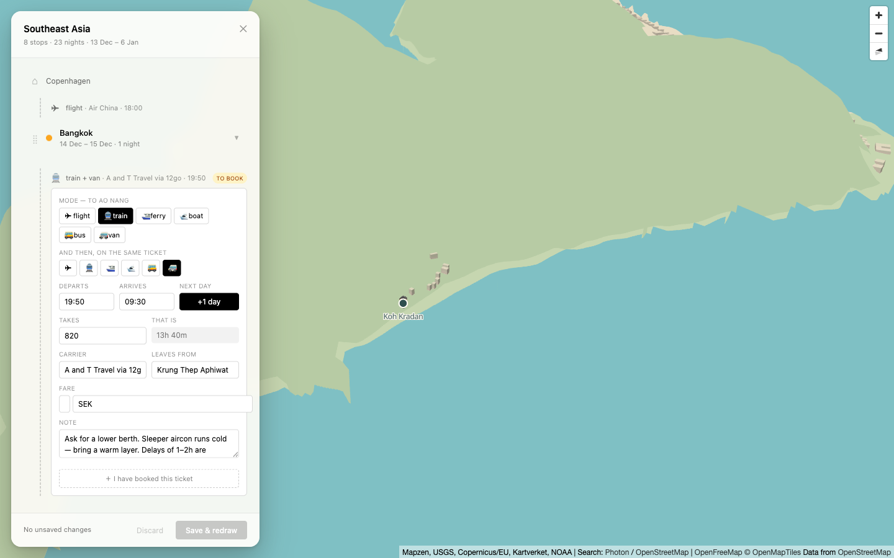
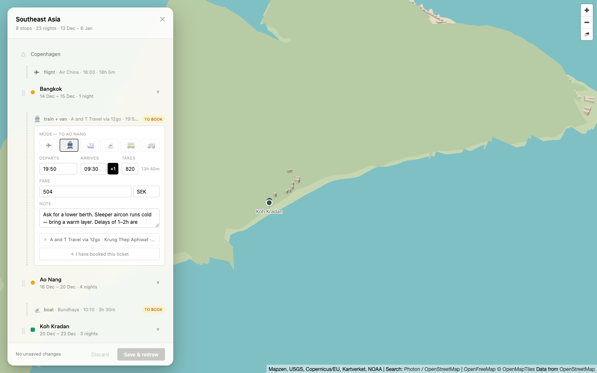
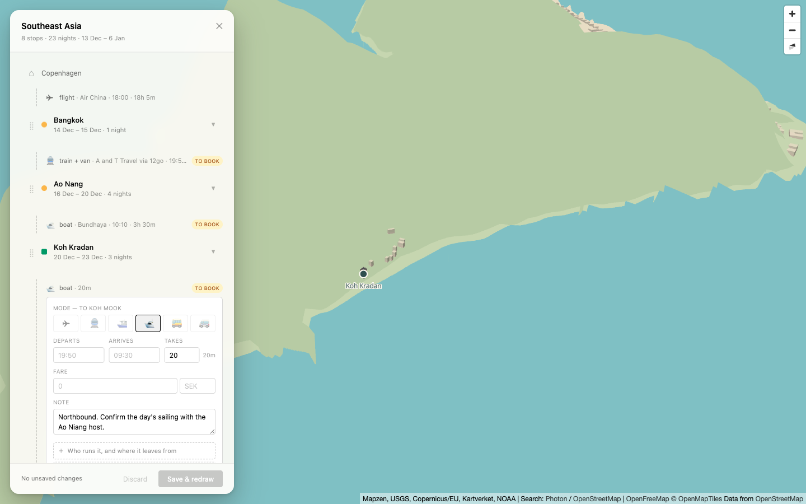
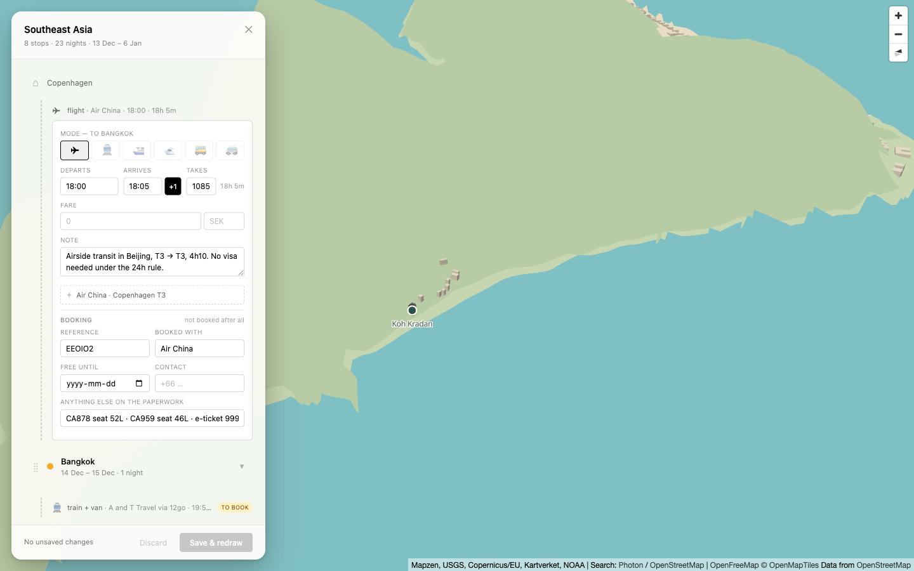
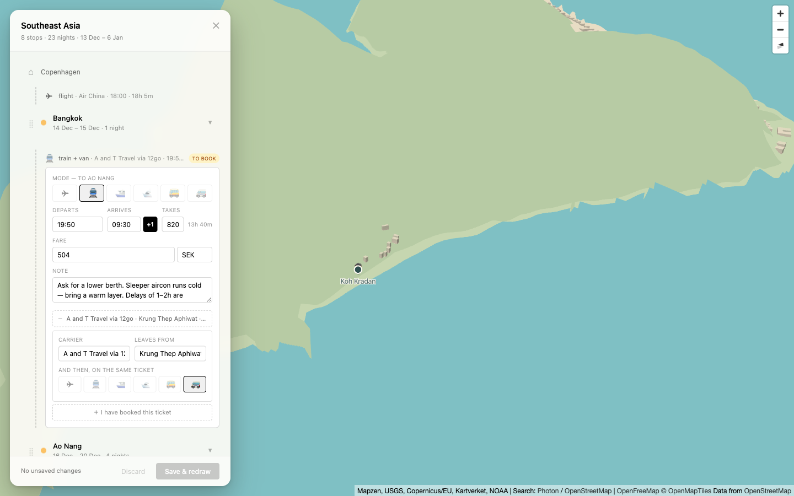

# The Leg card, cut from eleven questions to four

Evidence for [#28](https://github.com/adrianpetersson/onward/issues/28). Every shot is the **real
trip** (`docs/real-trip/sea-xmas-2026.json`) at 1440×900, and the before/after pair is the same Leg —
the Bangkok → Ao Nang sleeper, the richest one on the Itinerary — from the same camera and the same
scroll position.

## What the measurement said

The ticket proposed the split from a screenshot: keep Mode, both times, Fare and Note; demote
`secondMode`, `durationMin`, `carrier`, `fromPlace` and `dayRoll`. Counting how often each field is
actually filled across the trip's nine Legs put one of those in the wrong tier:

| field         | filled on | ticket said                                        | shipped                                                                        |
| ------------- | --------- | -------------------------------------------------- | ------------------------------------------------------------------------------ |
| `mode`        | 9 / 9     | keep                                               | fast path                                                                      |
| `durationMin` | **9 / 9** | **demote** — "derived display, empty on every Leg" | **fast path**                                                                  |
| `note`        | 9 / 9     | keep                                               | fast path                                                                      |
| `price`       | 5 / 9     | keep                                               | fast path                                                                      |
| `carrier`     | 5 / 9     | demote                                             | service fold                                                                   |
| `fromPlace`   | 5 / 9     | demote                                             | service fold                                                                   |
| `depart`      | 4 / 9     | keep                                               | fast path                                                                      |
| `arrive`      | 4 / 9     | keep                                               | fast path                                                                      |
| `dayRoll`     | 2 / 9     | demote                                             | `+1` on the arrival                                                            |
| `secondMode`  | 1 / 9     | demote                                             | service fold                                                                   |
| `via`         | 0 / 9     | —                                                  | no control at all ([#29](https://github.com/adrianpetersson/onward/issues/29)) |

`durationMin` is filled on **every** Leg, and on five of them — Koh Mook, Koh Lipe, Langkawi, George
Town, Kuala Lumpur — it is the _only_ quantitative fact there is, no times at all. That is verbatim
what `model.ts` says the field is for: "the only quantitative fact most unbooked Legs have — 'ferry,
1h30' and nothing else." Demoting it would have folded away the one thing most of the Itinerary knows.

What _is_ a derived display is the **`That is`** echo beside it, which used to cost a labelled field of
its own and now rides inside the `Takes` field. The ticket wrote the two as one item.

The numbers are pinned in `src/sidebar/leg-fields.test.ts`, read out of the real trip through
`readEnvelope`, so they fail if either the split or the itinerary moves.

## Before and after

|                                                                                                                                                        |                                                                                                                                                      |
| ------------------------------------------------------------------------------------------------------------------------------------------------------ | ---------------------------------------------------------------------------------------------------------------------------------------------------- |
|                                                                                                                  |                                                                                                                    |
| **497 px**, ten labelled fields plus the `That is` echo — the ticket's eleven questions. The Mode row's six labelled buttons wrap to two rows (57 px). | **338 px**, four rows: Mode, the times, Fare, Note. The Mode row is one row of glyphs (31 px). Two more Stops and another Leg fit in the same space. |

Both cards fit the 734 px scroll viewport, so "no scrolling" was already true for the _card_; what the
159 px buys is the **ribbon around it** — you can see where the Leg sits in the trip while you edit it.

The before shot also shows a defect this ticket found in passing and fixed: **the Fare amount box is
18 px wide**, three characters of a four-figure fare, because `MoneyInput` appended `w-16` to a class
string that already carried `w-full` and Tailwind resolved the conflict the other way. It predates
#28 (`fields.tsx` untouched since [#10](https://github.com/adrianpetersson/onward/issues/10)) and it
hit the Stay price the same way.

## The other three states

| shot                                        | what it shows                                                                                                                                                                                                                                                                                                                                                                                                                                                  |
| ------------------------------------------- | -------------------------------------------------------------------------------------------------------------------------------------------------------------------------------------------------------------------------------------------------------------------------------------------------------------------------------------------------------------------------------------------------------------------------------------------------------------- |
|          | **Koh Mook — a boat that knows only how long it takes.** No times, so no `+1` is offered; the service fold is an invitation rather than a summary. `20` is the only value in the row: `19:50`, `09:30`, `0` and `SEK` are placeholders, now dimmed to `text-black/25` so an empty times row cannot read as a filled one.                                                                                                                                       |
|  | **Air China, the falsifying case for `dayRoll`.** 18:00 → 18:05 **+1**: an arrival _later in the day_ than its departure that still rolls, because the flight takes 18h05. #28 suggested the `+1` appear "when an arrival lands before its departure", which misses the trip's very first Leg — so it stays a control. Nothing can derive it either: no offset is stored, which is the same reason `model.ts` refuses to derive `durationMin` from two clocks. |
|       | **The demoted tier, open.** Carrier, Leaves from, and the second Mode. `carrier` deliberately did **not** move inside the Booking block, though it reads like paperwork: `model.ts` rules it "known before any ticket exists, so it cannot belong to the Booking", and burying it there would make it unreachable until the traveller claimed to have booked something.                                                                                        |

## Nothing is deleted, and nothing is hidden either

`edit-leg` applies a `Partial<Leg>` over the existing Leg, so a field the card stops rendering keeps
its value. Verified end to end rather than read off the reducer: with the sleeper open, one click on
the ferry glyph changed the Mode and left the fold summary byte-identical —
`A and T Travel via 12go · Krung Thep Aphiwat · then a van` — with the collapsed row updating to
`⛴ ferry + van · A and T Travel via 12go · 19:50 · 13h 40m`.

Demotion can still cost _visibility_, which is the part worth guarding: five of nine Legs have a
carrier, and a fold that gave no sign of one would read as having lost it — the same shape of lie
[#30](https://github.com/adrianpetersson/onward/issues/30) records elsewhere in this card. So the
closed row states what it holds. The `+1` follows the same rule from the other direction: it survives
its own times being cleared, so a `+1` that arrived with an imported Leg can always be un-rolled.
